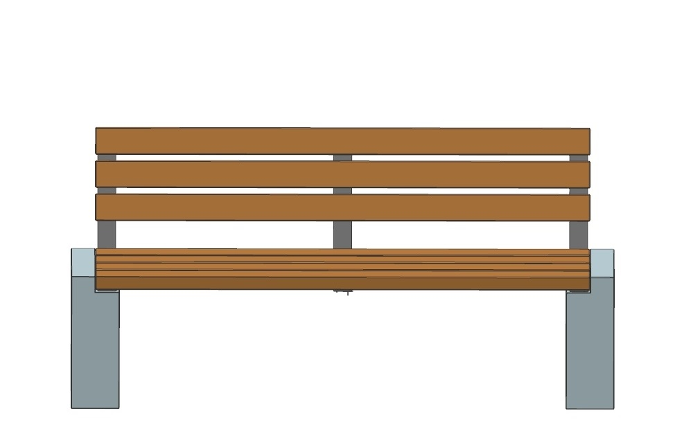
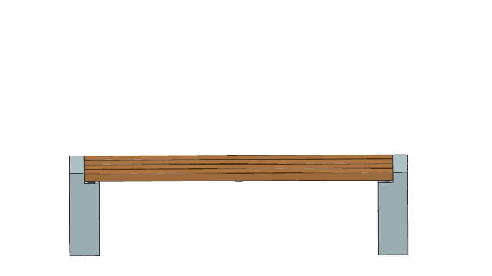
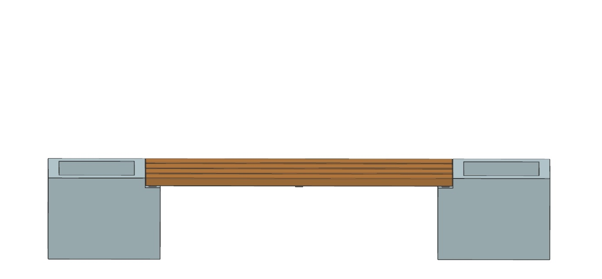

# itea - customizable garden bench
### 03 Orange Grade: Single Level of Abstraction (SLA) & Single Responsibility Principle (SRP)

Rules:

* Don't change `existing code` (e.g. no refactoring) until it is specifically asked for in the task
* 100% `code coverage` is required after each task
* Do not read ahead. Do this kata step by step.
* You will find your tasks when there is a title called `... to implement`. This is part of the Kata you have to do.

Introduction:

The `itea furniture store` is a new startup that sells all kinds of goods in their stores. 

After selling standard products 
like chairs, tables and pictures the company wants to prepare for the summer and offer one new customizable bench for the garden.
While all the products before were just purchased and sold the new garden bench is produced by a local partner and produced by demand.
Therefore, customers can customize the product whatever they want.
The new garden bench consist of the following components:
- wood plate (arbitrary length)
- two pedestals (plant element or default element)
- restback (optional, only one restback product exists)

The product can be shipped (for extra charge) or collected. Here are some examples:

In a first step the company wants to calculate the price with given information and print out a sheet of paper with 
information of the product so the product can easily be produced in a factory.

Oh no, this is going to be complicated. It will take hours to calculate the price. Happily, Joe, the last intern of the 
company already started with the implementation of the product. Sadly, Joe left the company, so it was decided that it 
is your job to complete it. No, problem, you think. Then you look into the code ...

-----
Here are the tasks that you have to implement for this Kata:

<b> Note: You might note several 'issues' with the code while working on the tasks. Try to stick to the actual task without cleaning up too much. You can always do that later.</b>

### First Task to implement:

'Optimize method calculateAndPrint() in CalculatorGardenBench' 
   1. Refactor the method bringing all steps to the same level of abstraction (so the method only calls other methods)
   2. Why hasn't Joe (the intern) made use of the SLA principle in the first place? What might be the main reason?
   3. How can you persuade people in the future (e.g. new interns) to apply the SLA principle? What are the main benefits?

---

### Second Task to implement:

'Seperate calculation and printing'
1. Are you happy with the way that calculateAndPrint() does more than one thing? Make sure each method in the class only contains one responsibility.
2. Does it make sense to add (one or) more classes? Which is the best approach? Which one do you want to implement (be aware of the time!)

---

If you have still time left you can try to do even more refactoring or do the bonus task below.

### Bonus Task to implement:

'Price Change'

A market analysis conducted by your companies predicts an extremely high demand in the summer for the garden bench at the current price.
Therefore, the management wants to increase the price by 10 to 20% (depending of the day of the week: monday to thursday 10%, fr and sat 20%). What do you do? Implement your ideal solution. 
