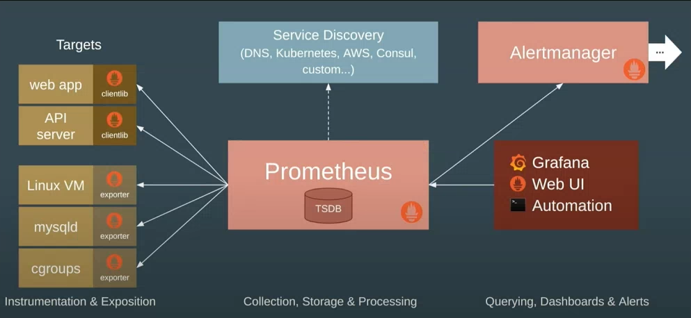

# ITEA 22 - Monitoring / Logging

## Intro

### Background story

The ***ITEA Furniture Store*** is a company that primarily sells furniture and home decoration in their stores.
You have been hired as a software developer to help them team implement new features.

Today you will have a look on a service you have never seen before.
And you should enforce the Coding Rules of the Team and Architecture of the software.

## What does monitoring do?

## Why logging is related to monitoring

In basic "logging is just the application writing something into a file". That might be true for an application only
running a single instance on a physical machine. When it comes to modern applications running in multiple instances with 
load balancing on a containerized cloud platform, you will need more than write a local logfile to later on read it.
What if the restart of a crashed container drops all logs before they can be backed up. How will you find the reason for the crash? 
You may need to have the log entries of all instances in sorted order of the occurrence to research an error reason.
This is where monitoring Systems are handy too. Just let your application mirror every log entry to a monitoring system 
and store them into its database. The result is having logs of all application instances aggregated at a single place where you can 
search and filter the contents efficiently. Most log aggregation systems also support to visualize reoccurring log entry events.

### Exercise 1

The Basic configuration of spring actuator is already activated for the itea-be

1. Start the application and try http://localhost:9000/actuator. Does it work?
2. Correct the URL
3. What monitoring information do you get in basic configurations?
4. Try to activate exposing more information. Look at the documentation to find out how.  
   https://docs.spring.io/spring-boot/reference/actuator/index.html
5. **Discuss with the group:**  
- Why can it be a security problem to use monitoring?
- What can you do to improve security?
6. Restrict the information to just show general information and status of the application

### Exercise 2

Configuring one endpoint. We will look at the health monitoring

1. Can you get more detailed information about system health?
2. What sub statuses do we have in the application?

### Exercise 3

show metrics

1. Activate showing metrics in actuator
2. Browse the metrics. Select some and dive into its details.
3. Discuss the different types of metrics you find. 
4. What happens if you reload the page?
5. Try to make a api request and search for the metrics related to it.
6. **Discuss with the group:**  
- How can you use the metrics to monitor your application?
- Can you get statistics from only using Actuator or will it need more?

### Exercise 4

Monitoring systems and visualization
We will use the Prometheus adapter of Actuator because it is the only monitoring system
that uses pull principle (so-called "scraping"). Therefore, Actuator provides a web endpoint to read the metrics.
For visualizing the Monitoring stats, we will use Grafana
A Docker compose file is provided in the project to start a Prometheus and Grafana server is located in the resources subfolder "monitoring"

1. Enable Prometheus registry and expose the endpoint
2. Can you tell differences to the *metrics/* endpoint?
3. Add a scraping configuration to the prometheus.yaml configuration file
4. Start the docker files you can reach Prometheus at http://localhost:9090 (no user/password) and Grafana at http://localhost:3000 (admin:admin)
5. Check the scrape was successfully in the "targets" view of Prometheus
6. In Grafana configure the Prometheus server as a new datasource
7. Create a new dashboard to get a visualization for the itea application metrics and watch the application running
(HINT: community has provided a lot of ready to use dashboard configs you can import https://grafana.com/grafana/dashboards/) 
8. **Discuss with the group:**  
- Compared to just using actuator, what possibilities does a monitoring/visualization system give you to monitor your application?

### Exercise 5

Actuator and logging

### Conclusion

