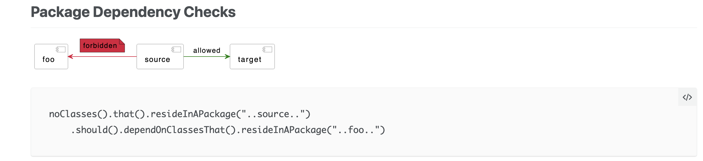

# ITEA 19 - ArchUnit

## Intro

### Background story

The ***ITEA Furniture Store*** is a company that primarily sells furniture and home decoration in their stores.
You have been hired as a software developer to help them team implement new features.

Today you will have a look on a service you have never seen before.
And you should enforce the Coding Rules of the Team and Architecture of the software.


## Why test your architecture?

https://www.archunit.org/motivation

```
Most developers working in larger projects will know the story, where once upon a time somebody experienced looked at the code and
drew up some nice architecture diagrams, showing the components the system should consist of, and how they should interact.
But when the project got bigger, the use cases more complex, and new developers dropped in and old developers dropped out,
there were more and more cases where new features would just be added in any way that fit. 
And suddenly everything depended on everything and every change could have an unforeseeable effect on any other component.
Of course, you could have one or several experienced developers, having the role of the architect,
who look at the code once a week, identify violations and correct them.
But a safer way is to just define the components in code and rules for these components that can be automatically tested,
for example as part of your continuous integration build.
```

### What is ArchUnit?

https://www.archunit.org/userguide/html/000_Index.html

```
ArchUnit is a free, simple and extensible library for checking the architecture of your Java code.
That is, ArchUnit can check dependencies between packages and classes, layers and slices, check for cyclic dependencies and more.
It does so by analyzing given Java bytecode, importing all classes into a Java code structure.
ArchUnit’s main focus is to automatically test architecture and coding rules, using any plain Java unit testing framework.
```

### Example

https://www.archunit.org/use-cases



### Exercise 1

In our fist task we will use the standard rule set from ArchUnit, and we will see if those rules passes in our codebase.

The rules that we use here can be found in the ArchUnit Api under `GeneralCodingRules`: https://javadoc.io/doc/com.tngtech.archunit/archunit/latest/com/tngtech/archunit/library/GeneralCodingRules.html

1. Create a new folder in the test directory called `architecture`.
2. Create a new Java class called `TeamRulesTest` in the `architecture` folder.
3. Create your fist ArchUnit test, that tests, that we are not using a `deprecated api`
4. Write a test to check no classes uses the java logging
5. Write a test to check that no classes are using jodatime
6. Write a test to check that no classes are throwing a generic exception

### Exercise 2

1. Create a new Java class called `FieldRulesTest` in the `architecture` folder.
2. Write a test that checks that all fields for the `*UseCase.java` classes are private.
3. Write a test that checks that all fields with the suffix `UseCases` are `private` and `final`.

### Exercise 3

1. Create a new Java class called `ControllerRulesTest` in the `architecture` folder.
2. Write a test that checks that all classes in the `controller` package have the `@Controller` annotation.
3. Write a test that checks that all classes in the `controller` package have the suffix `Controller` in their name.


### Exercise 4

1. Create a new Java class called `ArchitectureRulesTest` in the `architecture` folder.
2. Write a test that checks that all classes in the `controller` package only call the `useCases` package
3. Write a test that checks that all classes in the `useCases` package not call the `controller` or the `persistence` package

### Conclusion

ArchUnit can more than just check the architecture of your code.
You can write tests about your `Fields`, `Classes` and `Method calls` and much more.
I recommend to try this framework in your projects and see what is hiding in your code, that you do not want to be there.