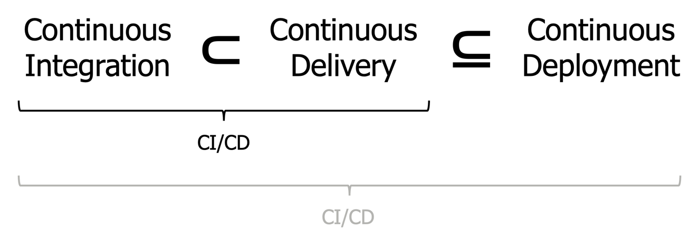

# ITEA 23 - CI/CD: Continuous Integration and Continuous Delivery

## Background story

The ***ITEA Furniture Store*** is a company that primarily sells furniture and home decoration in their stores.
You have been hired as a consultant to help with their digital transformation.

## Intro – Concepts

CI/CD is more than "just a pipeline". The term is often misunderstood or misused, which only spreads the misconceptions
further.

**CI** stands for **continuos integration**. It means we continuously (i.e., frequently, regularly) integrate (i.e.,
merge) each others changes together into a common code base (main branch or trunk), at least once per day, but usually
multiple times per developer per day.

**CD** stands for **continuous delivery**: The ability to release at any point on demand. A feature is ready? We can
*decide* to simply release it. A bug is fixed? We can simply release the new version, easily and safely.

**CD** can also stand for **continuous deployment**, a special case of continuous delivery where every *releasable*
build is automatically deployed. By default, CD means the more general continuous delivery.

**DevOps** is the collaboration (!) between development and operations (a.k.a. "Ops", i.e. system admins or cloud
engineers) using practices like CI/CD, monitoring, and a culture of shared responsibility ("you build it, you run it").
It is *not* "operations for development", nor is it a separate role or even a separate department that "does the DevOps
for the other teams".

The goals of these practices include: identify bottlenecks, find and fix/prevent integration problems earlier (merge
conflicts,
incompatibilities, etc.), minimize the risk per release, and get early and frequent feedback from users and customers.

## Kata – Part 1

On the Miro board (the link will be shared in the session), solve and discuss the provided exercises together.
Discussing and understanding the nuances is more important than "correct" answers, because a lot of it depends on the
context.

## Kata – Part 2

### Exercise 2.1: Basic continuous integration

In the simplest case of CI, we work directly on the main branch (a.k.a. the trunk). Sounds dangerous? We will look at
how to do this safely. Forget any "universal" rules you may have learned about "never committing to main". Context
matters and universal rules are rare!
Later we will look at variants of CI where we don't work directly on main.

*Breakout sessions in pairs or groups ("ensembles") of 2-5 people each. Ensure at least one per ensemble has push
privileges.*

#### Tasks:

- TODO

#### Rules:

- Commit and push directly to main, at least once every 5 minutes.
- TDD + only push on green.
- `git pull --rebase`
- If the tooling allows it, rotate the "driver" role after every commit.

### Exercise 2.2: "Corporate" continuous integration

In many environments, there are reasons to deviate from that simplest version of CI. Still, consider it the default in
case nothing requires additional process overhead.

For example, for compliance reasons it might be necessary to have a "paper trail" proving that at least 2 people have
worked on a change ([Two-person rule](https://en.wikipedia.org/wiki/Two-person_rule), in German "Vieraugenprinzip") to
make it impossible for a "single bad actor" to intentionally act maliciously. Such a paper trail is easily provided by
many pull request tools. Another reason could be that the tooling has support for pull request integration of pipelines
and static analysis. However, that does not mean we need to block the flow by waiting for someone to asynchronously
review the code *when they get to it, after it is already finished* to ask for additional changes. 
*Pull request != code review* and *code review != pull request*.

#### Tasks:

- TODO

#### Rules:

- 1 to 3 related commits on a so called "topic-branch" (*not* a whole feature).
  These branches are short-lived (merged within a day, usually shorter). It's not CI if we don't, well, *continuously
  integrate*!
- Pull request as "proof of pair/ensemble programming". Merge it immediately.
- Pipeline runs automatically after merge (and if the tooling allows, also in the PR before the merge).
